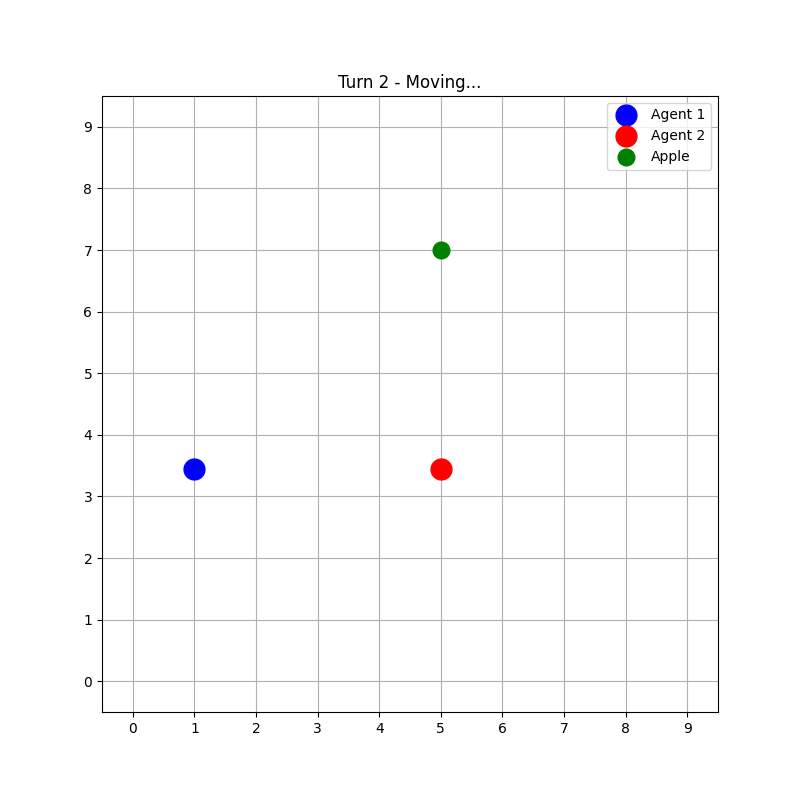
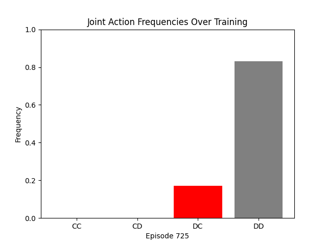
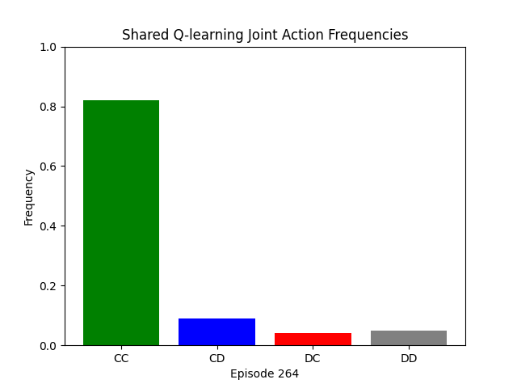

# Multi-Agent Q-Learning Experiments

Some basic experiments exploring cooperation and competition in multi-agent reinforcement learning systems (q-learning)

## Overview

This repository contains simple implementations testing how different Q-learning approaches affect agent behavior in competitive and cooperative scenarios. The experiments compare individual vs shared learning approaches across different game environments.

## Experiments

### 1. Grid World Apple Collection (`greedy_agents.py`, `indiv_q_learning.py`, `shared_q_learning.py`)

**Environment**: 10x10 grid where two agents compete to collect a single apple while avoiding collisions.

**Reward Structure**:
- Apple collection: +10 points (winner takes all)
- Collision: -2 points for both agents
- Small step penalty: -0.01 points (encourages efficiency)

**Agent Types**:

#### Greedy Agents (`greedy_agents.py`)
- **Strategy**: Always move directly toward apple (Manhattan distance)
- **Behavior**: High collision rates, no learning
- **Purpose**: Baseline for comparison

#### Individual Q-Learning (`indiv_q_learning.py`)
- **Strategy**: Separate Q-tables, independent learning
- **Issues**: Agents often get stuck in safe corners, avoid risk
- **State Space**: (my_pos, other_pos, apple_pos)

#### Cooperative Q-Learning (`shared_q_learning.py`)
- **Strategy**: Shared Q-table, coordinated actions
- **Features**: 
  - Normalized state representation
  - Cooperation bonuses for collision avoidance
  - Shared rewards (winner gives 20% to partner)
  - Agent 2 can see Agent 1's chosen action

### 2. Prisoner's Dilemma (`pd.py`, `pd_together.py`)

NOTE: This code was for my own experimentaiton/understanding. The experiments are simple, and purely just to test out basic RL concepts in a small setting.

**Environment**: Classic 2-player Prisoner's Dilemma with standard payoff matrix.

**Payoffs**:
- Both Cooperate: (3,3)
- Both Defect: (1,1) 
- One Defects: (5,0) or (0,5)

#### Individual Q-Learning (`pd.py`)
- **Strategy**: Separate Q-tables per agent
- **State Space**: Previous joint action
- **Expected**: Competition, mutual defection

#### Shared Q-Learning (`pd_together.py`)
- **Strategy**: Single Q-table learning joint actions
- **Optimization**: Maximizes sum of both players' rewards
- **Expected**: Higher cooperation rates

## Key Findings

### Grid World Results
- **Greedy agents**: ~50% collision rate, deterministic but inefficient
- **Individual Q-learning**: Low apple collection, agents avoid risk
- **Shared Q-learning**: Better coordination, fewer collisions, (somewhat...) balanced rewards

### Prisoner's Dilemma Results
- **Individual**: Tends toward mutual defection (Nash equilibrium)
- **Shared**: Higher cooperation rates when optimizing joint reward
